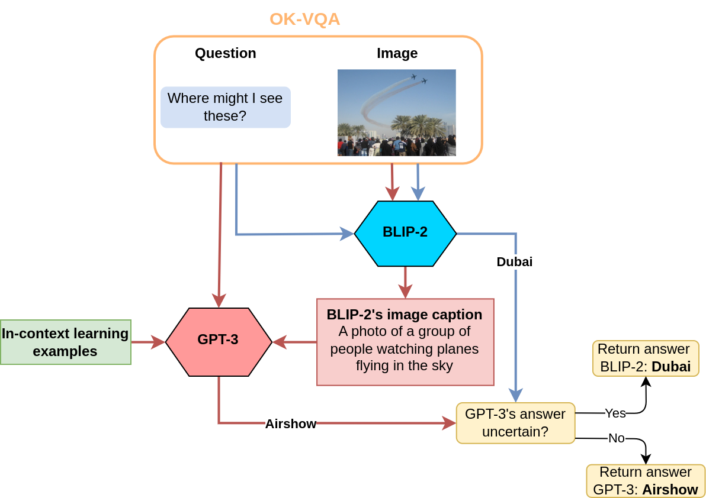

# BLIP-2.3: Improving BLIP-2 by employing ChatGPT3 in context learning
> Authors: J. Belleman, M.J.A. Bosch, D.G. van Dijk, E.R. Langezaal & T. Veenboer \
> Deep Learning 2 - University of Amsterdam
## Table of contents

- [Introduction](#introduction)
- [Background Literature](#background-literature)
- [Related Work](#related-work)
- [Strengths and Weaknesses of BLIP-2](#strengths-and-weaknesses-of-blip-2)
- [Datasets](#datasets)
- [Reproduction](#reproduction)
- [Extending BLIP-2 with GPT3](#extending-blip-2-with-gpt3)
  - [Problem description](#problem-description)
  - [BLIP 2.3 Pipeline](#blip-23-pipeline)
  - [Unsuccesful Explored approaches](#unsuccesful-explored-approaches)
    - [Approach 1: Image specific VQA context](#approach-1-image-specific-vqa-context)
    - [Approach 2: Salient noun prompting](#approach-2-salient-noun-prompting)
- [Results and Analysis](#results-and-analysis)
- [Conclusion](#conclusion)
- [References](#references)

## Introduction

The field of vision-language pre-training (VLP)[^2] has seen significant progress in recent years, with researchers employing pre-trained models of increasingly larger scale. However, to effectively leverage pre-trained unimodal models for vision-language tasks, it is essential to facilitate cross-modal alignment.

In this research we highlight the novel BLIP-2[^5] architecture; the proposed BLIP-2 method introduces a new two-stage pre-training strategy to achieve cross-model alignment between frozen unimodal models. This is significant, as it has the potential to accelerate progress in the development of vision-language models, enabling the deployment of such models in real-world applications such as visual question answering. BLIP-2 already outperforms the state-of-the-art on zero-shot visual question answering with 57x fewer trainable parameters[^5], allowing researchers with limited computing resources to contribute to developments in this area. 

For this project we focus on extending BLIP2. BLIP-2 represents a generic and efficient pre-training strategy that bootstraps vision-language pre-training from frozen pre-trained image encoders and frozen large language models. To bridge the modality gap it utilises a Querying Transformer (Q-Former) which is trained in a representation learning and generative learning stage.
We create BLIP-2.3 (the combination of BLIP-2 and GPT-3) with the aim to enhance the performance of the BLIP-2 model on vision-language tasks. This improvement will be achieved by leveraging the learning and language generation capabilities of GPT-3 through its API. The goal is to unlock in-context learning capabilities in BLIP-2.3 in order to achieve better performance.

Overall, this research aims to leverage the strengths of both BLIP-2 and GPT-3 to enhance the in-context learning capabilities of BLIP-2 and improve its performance on (zero-shot) Visual Question Answering (VQA[^7]) tasks. This study will try to provide insights into how the strengths of different models can be combined to achieve better performance on complex tasks.

## Background Literature
We are focusing on the subdomain of artificial intelligence known as multi-modal learning. Specifically, we will focus on the combination of vision and language. Powerful neural vision networks have existed for a couple years, achieving breakthroughs with Convolution Neural Networks[^4] and more recently by employing Vision Transformers[^3]. Especially in language it has been shown that incredible performance can be achieved using ever larger models (LLM's) that can capture and comprehend more contextual information. Current state of the art is achieved by GPT3[^1], a language model that can perform a plethora of tasks. A downside of this increase in complexity is that finetuning and training these models is becoming increasingly resource intensive, motivating research into using pretrained models and therefore the research field known as Vision Language Pretraining (VLP)[^2]. It has already been shown that this combination can learn to perform both vision-language understanding and generation tasks, for example with the BLIP architecture[^6]. 

## Related Work

Vondrick and Menon[^13] present a method to enhance zero-shot classification performance of the CLIP[^14] on various datasets such as ImageNet and EuroSAT. Their alteration to CLIP consists of producing a set of different descriptors for a given category. For the classification of an arbitrary image, the embeddings of the image are compared with the embeddings of these descriptors. The class with the highest image-versus-descriptor similarity score is chosen as the most probable category for the image. Unfortunately, their work does not extend to the domain of open-ended question answering. There is no prospect of generating descriptors for certain answers because the set of possible answers a model can give is infinite.

In a recent paper, Liu et al. [^15] showcase a model that leverages an ensemble of pre-trained expert models to create several vision-language capabilities. Their full model, Prismer, relies on the efficiency of other models that have been trained to be state-of-the-art in their respective modality. For example, the set of expert models can include a variety of networks that examine objects within an image, that can do Optical Character Recognition (OCR) and are capable of distinguishing the various parts of an image (segmentation). The combined information these models are then processed by a smaller sized network which translates the information into text encodings; this is alike the Q-Former's functionality in BLIP-2. Akin to BLIP, the smaller model then proceeds to pass the encodings to a language decoder that outputs a prediction, caption or answers a visual question. It might be interesting to explore the possibilities of adding such ensembles of experts to the vision stage of BLIP along with the suggested adjustments in this paper.

Hu et al. [^16] demonstrated that the world knowledge of GPT-3 can be conveniently taken advantage of with their question-aware captioning model PromptCap. The PromptCap model is a small trainable model which generates context for the question GPT answers at a later stage. For instance, a sample question for an image of a microscope could be: 'Who invented this apparatus?'. PromptCap then generates a small caption belonging to the image which could be along the lines of: 'This is a researcher looking through a microscope'. Thereafter, GPT-3 is prompted with the combination of the question and caption. The question and caption are sufficient for GPT-3 to answer: 'A Dutch spectacle maker named Zacharias Janssen'. The PromptCap model is similar to BLIP-2 to a high degree. Instead of applying the power of a pre-trained Vision Model (VM), PromptCap transforms the image to text immediately by finetuning to the dataset. Our research builds on the usage of GPT-3 in related fashion. However rather than fine-tuning, we utilize GPT-3's in-context learning capabilities by answering questions with few-shot learning based on BLIP-2's image captions. 

## Strengths and Weaknesses of BLIP-2

BLIP-2 is designed with a modular framework; both the VM and LM are interchangeable frozen models. The future will likely see more lightweight or powerful models, which can be employed with BLIP-2 by simply re-training the Q-Former. To illustrate, if OpenAI decides to release GPT-3 at a later point in time, the Q-Former can easily be adjusted to function in a pipeline with GPT-3 as frozen LM. On top of that, the Q-Former itself is a relatively small neural network that can be trained without the resources that are required for present-day LLMs. This opens up areas of research for less affluent institutions or companies that are otherwise out-of-scope. 

Nevertheless, BLIP-2 has a few significant drawbacks in terms of efficiency. Firstly, BLIP-2 currently does not support in-context learning with the standard setup. The authors ascribe this to the fact that the model has been trained on a dataset which solely contains single image-text data pairs [^5]. They also address this by stating that they intend to train the model on a different, more expressive dataset in subsequent research. Moreover, BLIP-2 often has an inadequate response to questions that test the respondent's world knowledge. An example of such a question could be about the logo of a well-known company. BLIP-2 frequently does not recognize logos or brand marks because it is trained to dissect purely visual attributes of an image. Models that do have a vast source of world knowledge are usually closed source or too large to be deployed on a low-cost configuration. The research of this blogpost specifically fixates on interjecting GPT-3 into the workflow of BLIP-2 to increase the world knowledge of the model in its entirety. We intend to do so by directly letting GPT-3 reason about the visual cues it receives from the BLIP-2 pipeline.

## Datasets
As outlined in the introduction we focus specifically on Visual Question Answering[^7] datasets. These datasets consists of images, for example extracted from the COCO dataset[^8], each with various questions about an image and a bunch of exemplar answers per question. These answers are often only a few words, such that some form of quantitative evaluation can be performed by matching a model's output with these answers. 

The original BLIP-2 paper[^5] outlines 3 such datasets, which we also use for reproduction and our extension. Since the original VQA-dataset released by Antol et. al.[^9] contains some questions which can easily be answered without viewing the image[^10], the curated VQAv2 dataset[^10] is used. A lot of the questions in this dataset however are simple classification tasks, focussing merely on attribute recognition, counting or object detection. Therefore the OK-VQA dataset[^11] is also used, which focussed specifically on questions that require external knowledge. As such the OK-VQA dataset is especially interesting to test if we can harnest the plethora of real-world knowledge stored in GPT-3 with our extension. Following the same logic, the GQA dataset[^12] is also used, which too focusses on real-world visual reasoning and compositional question answering as oppposed to simple object recognition.

| VQA-V2  | OK-VQA  | GQA |
| ------- | ------- | --- |
|   |   |    |

While these datasets are manually curated using tools such as Amazon Mechanical Turk[^20], the label answers for the visual questions are from rather varying quality. In quite some cases some of the set of template answers for a question are blatantly wrong, such as answering "Africa" to the question "What south american country usually has this climate?". It is important to keep this mind, as the vast domain knowledge of GPT-3 can cause it give more precise/correct answers than the human annotaters, which are incorrectly counted as wrong because of this flawed gold standard. 

## Reproduction
The reproduction goal of our research focuses on a specific part of the results presented in the BLIP-2 paper. The original paper evaluates the performance of the BLIP-2 model on a variety of tasks such as visual question answering, image captioning and image-text retrieval. Since we aim in this research to enhance the in-context learning capabilities of BLIP-2 by combining its' strenghts with those of the GPT3 LLM we are interested in the performance of models on the VQA task. The achieved results on this task of various models on the datasets mentioned in the previous section are presented in table 2 of the original paper and can be seen below.

  

The red boxes indicate the results that we attempted to reproduce in our work. We focus on the bottom section of the table since only the BLIP-2 model itself is within the scope of this research. For the frozen vision transformer, we only utilize the ViT-g (ref) model for reproduction since the ViT-L (ref) model was not available to us. As for the frozen large language models, we include both the OPT (ref) as well as the FlanT5 (ref) model in our reproduction study. We test for both models only their smaller variants, namely the 2.7B and XL versions for OPT and FlanT5 respectively, since our compute resources limit us to not use their larger counterparts (6.7B and XXL variants).

Our reproduction results are presented in the table below. Based on the results in the table, we can state that the accuracies of the OPT and FlanT5 BLIP-2 model variants on the VQA task are succesfully reproducable.

<table align="center">
   <thead>
      <tr>
         <th>Models</th>
         <th>VQAv2 (val)</th>
         <th>OK-VQA</th>
         <th>GQA</th>
      </tr>
   </thead>
   <tbody>
      <tr>
         <td>BLIP-2 ViTg OPT2.7B</td>
         <td>53.4</td>
         <td>31.8</td>
         <td>34.6</td>
      </tr>
      <tr>
         <td>BLIP-2 ViTg FlanT5XL</td>
         <td>61.8</td>
         <td>39.3</td>
         <td>43.9</td>
      </tr>
   </tbody>
</table>
  
The LAVIS library by Salesforce [^17] provides an out-of-the-box approach to evaluating BLIP-2 with various different frozen Language Models. Through a single python file, evaluate.py, an end-user can easily configure which model that he wants to evaluate. The variety of LMs all come with their respective configuration file. Moreover, it supplies python scripts for downloading the different datasets that can be used with BLIP.  

Nevertheless, the reproduction of BLIP-2 posed a few issues. First of all, the authors mention in the paper that their prompt template differs for OPT and FlanT5. The prompt for OPT is supposedly 'Question: {}. Answer:', while FlanT5's prompt should be 'Question: {}. Short answer:'. However, we found in the LAVIS repository - maintained by the authors of BLIP2 - that the prompt is identical for both models, namely 'Question: {}. Short answer'. Furthermore, the method of retrieval for the FlanT5 model in the library ensures that it can only be used with the datatype bfloat16 (Brain Floating Point) [^18]. The bfloat16 dtype has been introduced by the Google Brain team to achieve higher performance with less memory requirements than a standard float32. Modern-day GPUs have the capability of performing matrix multiplications with the bfloat16; however, older GPUs do not always possess this ability. The GPU provided by our cluster was not able to execute the evaluation script with bfloat16. Therefore, we had to add and register the FlanT5 model with 8-bit integer weights in a separate file. Fortunately, LAVIS supplies the user with the effortless extensibility of registering new models by adding a single line.

The reproduction of BLIP-2 with the OPT model presented another difficulty. Initially, the LAVIS library was incompatible with the latest transformers library [^19] (above version >= 4.27 at the time of writing). This lead to the inaccessibility of several methods of the OPT model which in turn caused the evaluation script to throw various exceptions. After communicating with the developers of LAVIS, this was resolved swiftly with a code update to the library.

## Extending BLIP-2 with GPT3

### Problem description
The performance of BLIP-2 in visual question answering is subject to limitations due to inaccurate knowledge from the Large Language Model. As a result, despite correctly obtaining the visual information, BLIP-2 may generate incorrect inferences and ultimately produce unsatisfactory answers. For instance, BLIP-2 might be able to effectively recognize the object depicted in an image, but its' reasoning process may fail to correctly answer a related question. An example of this can be seen in the figure below, where BLIP-2's line of reasoning falls short since it does not consider weather circumstances of the location mentioned.

  

### BLIP 2.3 Pipeline
In this research project we aim at tackling this main bottleneck of the BLIP-2 model by combining BLIP-2's advanced visual question answering and image captioning capabilities with the general real-world knowledge of GPT-3.  The extension is primarily focused on augmenting the performance of the model on the OK-VQA dataset, which is specifically designed to necessitate external knowledge to answer the posed questions. We will utillize the GPT-3 model by feeding it visual information extracted from BLIP-2 to generate answers to the OK-VQA instances.

We do so by leveraging the GPT-3 API to incorporate in-context learning in a distinct way. Namely, we allow BLIP-2 to generate a general image caption to provide GPT-3 with enough visual context to answer the OK-VQA question. Finally, we combine the image caption and the OK-VQA question and input them into the GPT-3 model. The GPT-3 model then leverages its comprehensive world knowledge and the extracted visual information to answer the OK-VQA question. To enable in-context learning, we first augment the GPT-3 model's capabilities by providing a few example inputs and outputs. It is important to note that the effectiveness of GPT-3 in answering the OK-VQA question depends on the available context. In situations where the provided context is inadequate for GPT-3 to generate an answer, GPT-3 indicates this limitation, and in such cases, we rely on the original answer generated by BLIP-2.

  

## Results and Analysis

## Conclusion

## Ablation studies
In this section, we present a comprehensive analysis of two alternative methods that were employed and their corresponding outcomes and challenges encountered. The purpose of these ablation studies was to evaluate the effectiveness and limitations of different approaches in addressing the problem at hand. 

### Approach 1: Image specific VQA context
We initially investigated the feasibility of utilizing GPT-3 to generate specific questions that are essential for providing a meaningful answer to the OK-VQA question. These questions, generated by GPT-3, were then passed to BLIP-2, leveraging its visual question answering capabilities, in order to obtain additional visual context for the GPT-3 model. The obtained answers from BLIP-2, along with their corresponding questions and the original VQA-question, were subsequently inputted into the GPT-3 model to generate the final answer. However, this approach exhibited numerous inaccuracies due to BLIP-2's inability to successfully address the highly specific questions generated by GPT-3. As a result, either limited or inaccurate visual information was provided, where BLIP-2 occasionally fabricated responses that lacked factual accuracy.

### Approach 2: Salient noun prompting
Furthermore, we explored an alternative approach of letting GPT-3 pick the most salient noun within an OK-VQA question.  To accomplish this, we presented GPT-3 with a set of example questions paired with their corresponding target nouns, leveraging the in-context learning capabilities of GPT-3. The selected noun was then employed to construct a more context-specific prompt for BLIP-2, enabling it to generate an image caption that specifically highlights the relevant portion of the image necessary for answering the OK-VQA question. This method exhibited an improvement in the performance of the BLIP-2 FlanT5_{XL} model on the OK-VQA dataset, with accuracy rising from 39.3% to 40.6%. However, despite this improvement, there were still instances where the performance of the model remained suboptimal.

Overall, it was determined that the simpler approach yielded the best performance, primarily due to BLIP-2's limited ability to generate accurate and truthful context when presented with highly specific prompts or questions. The misleading and inaccurate contextual information provided by BLIP-2 had a detrimental effect on GPT-3, leading to poor performance for both of the explored approaches.

## References
[^1]: Brown, T. B., Mann, B., Ryder, N., Subbiah, M., Kaplan, J., Dhariwal, P., Amodei, D. (2020). Language models are few-shot learners.

[^2]: Chen, F.-L., Zhang, D.-Z., Han, M.-L., Chen, X.-Y., Shi, J., Xu, S., Xu, B.
(2023). Vlp: A survey on vision-language pre-training. *Machine Intelligence Research*, 20 (1), 38–56.

[^3]: Han, K., Wang, Y., Chen, H., Chen, X., Guo, J., Liu, Z. (2022). A survey on vision transformer. *IEEE transactions on pattern analysis and
machine intelligence*, 45 (1), 87–110

[^4]: Krizhevsky, A., Sutskever, I., Hinton, G. E. (2012). Imagenet classification with deep convolutional neural networks. In F. Pereira,
C. Burges, L. Bottou, K. Weinberger (Eds.), *Advances in neural information processing systems* (Vol. 25). Curran Associates, Inc.

[^5]: Li, J., Li, D., Savarese, S., Hoi, S. (2023). Blip-2: Bootstrapping language-image pre-training with frozen image encoders and large language models.

[^6]: Li, J., Li, D., Xiong, C., Hoi, S. (2022). Blip: Bootstrapping language-image pre-training for unified vision-language understanding and generation. *
International conference on machine learning* (pp. 12888–12900).

[^7]: Antol, S., Agrawal, A., Lu, J., Mitchell, M., Batra, D., Zitnick, C. L., & Parikh, D. (2015). VQA: Visual question answering. *Proceedings of the IEEE international conference on computer vision* (pp. 2425-2433).

[^8]: Lin, T. Y., Maire, M., Belongie, S., Hays, J., Perona, P., Ramanan, D., & Zitnick, C. L. (2014). Microsoft coco: Common objects in context. In *Computer Vision–ECCV 2014: 13th European Conference, Zurich, Switzerland, September 6-12, 2014, Proceedings, Part V 13* (pp. 740-755). Springer International Publishing.

[^9]: Antol, S., Agrawal, A., Lu, J., Mitchell, M., Batra, D., Zitnick, C. L., & Parikh, D. (2015). Vqa: Visual question answering. In *Proceedings of the IEEE international conference on computer vision* (pp. 2425-2433).

[^10]: Goyal, Y., Khot, T., Summers-Stay, D., Batra, D., and Parikh, D. Making the V in VQA matter: Elevating the role of image understanding in visual question answering. In *CVPR*, pp. 6325–6334, 2017

[^11]: Marino, K., Rastegari, M., Farhadi, A., & Mottaghi, R. (2019). Ok-vqa: A visual question answering benchmark requiring external knowledge. In *Proceedings of the IEEE/cvf conference on computer vision and pattern recognition* (pp. 3195-3204).

[^12]: Hudson, D. A., & Manning, C. D. (2019). Gqa: A new dataset for real-world visual reasoning and compositional question answering. In *Proceedings of the IEEE/CVF conference on computer vision and pattern recognition* (pp. 6700-6709).

[^13]: Menon, S., & Vondrick, C. (2022). Visual Classification via Description from Large Language Models. ArXiv, abs/2210.07183.

[^14]: Radford, A., Kim, J. W., Hallacy, C., Ramesh, A., Goh, G., Agarwal, S., ... & Sutskever, I. (2021, July). Learning transferable visual models from natural language supervision. In International conference on machine learning (pp. 8748-8763). PMLR.

[^15]: Liu, S., Fan, L., Johns, E., Yu, Z., Xiao, C., & Anandkumar, A. (2023). Prismer: A Vision-Language Model with An Ensemble of Experts. ArXiv Preprint ArXiv:2303. 02506.

[^16]: Hu, Y., Hua, H., Yang, Z., Shi, W., Smith, N. A., & Luo, J. (2022). PromptCap: Prompt-Guided Task-Aware Image Captioning. ArXiv Preprint ArXiv:2211. 09699.

[^17]: Li, D., Li, J., Le, H., Wang, G., Savarese, S., & Hoi, S. C. H. (2022). LAVIS: A Library for Language-Vision Intelligence. ArXiv [Cs.CV]. Retrieved from http://arxiv.org/abs/2209.09019.

[^18]: N. Burgess, J. Milanovic, N. Stephens, K. Monachopoulos and D. Mansell, "Bfloat16 Processing for Neural Networks," 2019 IEEE 26th Symposium on Computer Arithmetic (ARITH), Kyoto, Japan, 2019, pp. 88-91, doi: 10.1109/ARITH.2019.00022.

[^19]: Wolf, T., Debut, L., Sanh, V., Chaumond, J., Delangue, C., Moi, A., … Rush, A. M. (2020, October). Transformers: State-of-the-Art Natural Language Processing. Proceedings of the 2020 Conference on Empirical Methods in Natural Language Processing: System Demonstrations, 38–45. Retrieved from https://www.aclweb.org/anthology/2020.emnlp-demos.6.

[^20]: Crowston, K. (2012). Amazon Mechanical Turk: A Research Tool for Organizations and Information Systems Scholars. In: Bhattacherjee, A., Fitzgerald, B. (eds) Shaping the Future of ICT Research. Methods and Approaches. IFIP Advances in Information and Communication Technology, vol 389. Springer, Berlin, Heidelberg.
